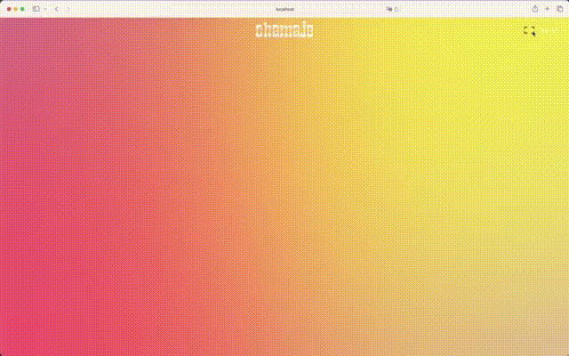
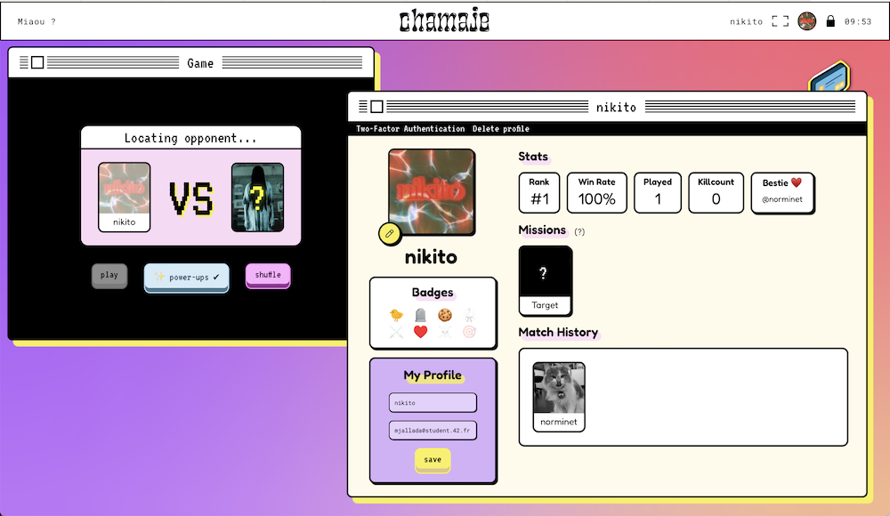
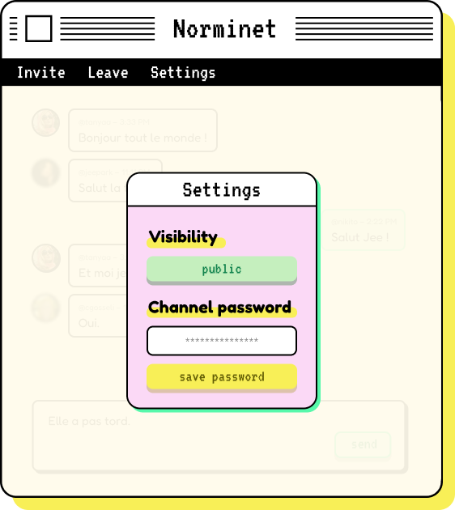

 
Our work on the 42Born2Code <b>ft_transcendence</b> project.  

 

# ft_transcendence

ft_transcendence is a web-based application designed for real-time interaction and gaming, particularly focused on the legendary game Pong. This project is crafted with a modern stack including ReactJS, NestJS, PostgreSQL, and Prisma, and showcases a neo-brutalist design meticulously planned in Figma.

## Overview

The application allows users to engage in the timeless classic Pong with others, accompanied by a user-friendly interface, live chat, and multiplayer online gaming functionalities. This project adheres to a set of strict technical requirements and security concerns to ensure a smooth and safe user experience.

### Technical Stack

| Frontend       | Backend | Database  | ORM      |
| -------------- | ------- | --------- | -------- |
| ReactJS        | NestJS  | PostgreSQL| Prisma   |

The frontend is implemented with ReactJS. The backend, powered by NestJS, provides a performant and scalable API that interfaces with a PostgreSQL database through Prisma, an object-relational mapper (ORM) that streamlines database operations.

### Design

- **Design Tool**: Figma
- **Design Aesthetic**: Neo-Brutalism
- **Desktop Experience**: The website was designed to simulate a desktop-like experience, while still integrating navigation arrows by utilizing URL state parameters within React to enhance user interaction and flow.

The design process in Figma focused on embracing neo-brutalism, a style that accentuates raw and exposed elements, to deliver a unique and fun user interface.

### Core Features

- **Real-Time Multiplayer Pong Game**: A live Pong game that respects the original 1972 version, with the addition of power-ups in the form of fun call-to-action triggers.
- **User Authentication**: OAuth system integration for secure login processes, using our school's API.
- **Chat Functionality**: Real-time chat capabilities with public and private channels, direct messaging, and user blocking.
- **User Profiles**: Customizable user profiles with avatars, two-factor authentication, friend lists, and live statuses.
- **Matchmaking System**: Automated pairing of players looking to compete in Pong matches.

### Security Measures

- **Authentication Tokens**: Implementation of a secure token and refresh token system to manage user sessions.
- **Password Hashing**: Secure storage of user credentials.
- **SQL Injection Protection**: Measures to prevent database exploitation.
- **Server-side Validation**: Validation for user input and form submissions.
- **Environment Variables**: Sensitive information stored in `.env` files and ignored by version control systems.

### Requirements

- **Single-Page Application**: Supports browser navigation features like Back and Forward buttons.
- **Browser Compatibility**: Functionality guaranteed for the latest versions of Google Chrome and one additional browser of choice (we picked Firefox).
- **Error Handling**: No unhandled errors or warnings for users.

### Docker Integration

- **Simplicity**: The entire application can be deployed using a single Docker command: `docker-compose up --build`.

## Contributions and Development

This project was brought to life by a team of three 42 students who shared a vision of reviving a classic game in a modern web environment, using a fun and colorful design aesthetic. 

Contributions were managed via Git, ensuring a collaborative and iterative approach to development, making good use of the `Issues` system.